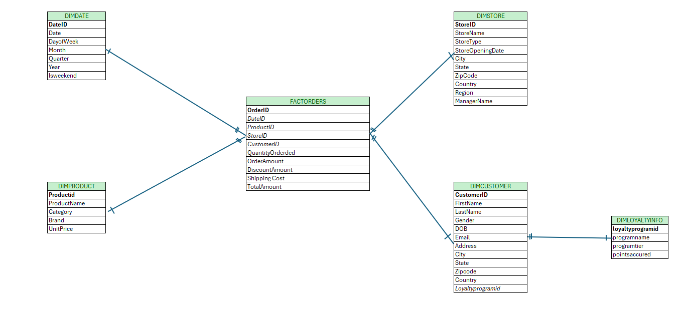
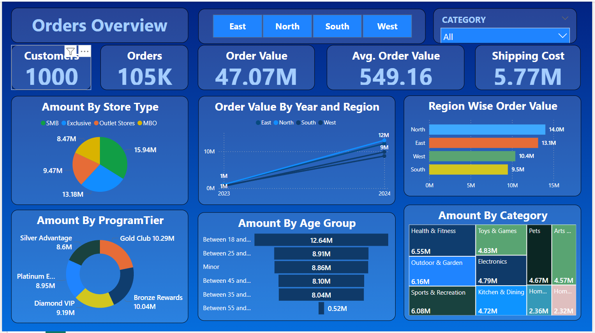

# End-to-End DWBI Project

A comprehensive Data Warehousing & Business Intelligence (DWBI) project covering:

- **ER Diagram Design:** Structuring data relationships
- **Star & Snowflake Schema:** Optimized data warehouse design
- **Test Data Generation:** Automating datasets using Python
- **Snowflake Setup & Data Loading:** Configuring Snowflake and managing data ingestion
- **Scenario-Based SQL Queries:** Executing complex queries for real-world cases
- **Report Blueprint & PowerBI Dashboards:** Designing and visualizing data insights

Hands-on experience with **Snowflake**, **SQL**, **Python**, and **PowerBI** to build a complete DWBI solution.

## Project Screenshots

### ER Diagram

### PowerBI Dashboard

